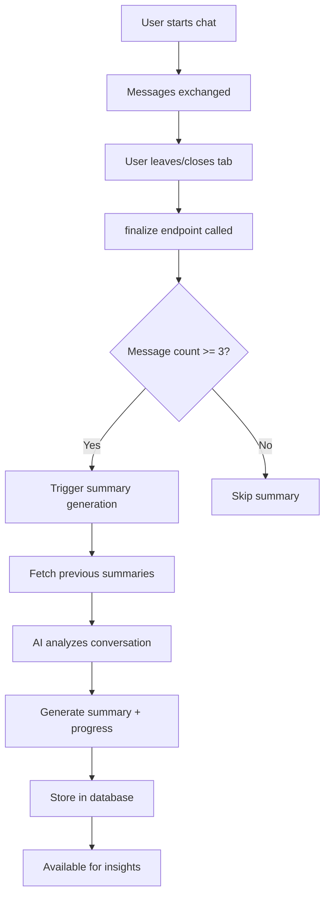

# Session-Based Insight Generation System

## Overview
Completely redesigned the insights system to be session-driven, where each chat conversation generates an AI summary that tracks user progress over time. This enables personalized, context-aware insights like "Your anxiety is improving" or "You're developing better coping skills."

## Key Changes

### 1. **Session Summary Generation** (NEW)
Every chat session now automatically generates:
- **Summary**: 2-3 sentence clinical summary of the conversation
- **Key Insights**: 2-3 takeaways from the session
- **Progress Indicators**: Structured tracking of:
  - `emotional_state`: improving | stable | declining | mixed
  - `coping_skills`: developing | consistent | needs_support
  - `resilience`: strengthening | maintaining | challenged
  - `engagement`: high | moderate | low
  - `primary_concerns`: Array of current concerns
  - `positive_changes`: Array of improvements noticed

### 2. **Database Schema** (NEW)
Added to `chat_sessions` table:
```sql
session_summary TEXT              -- AI-generated summary
progress_indicators JSONB         -- Progress tracking metrics
key_insights TEXT[]               -- Session takeaways
```

### 3. **Automatic Summary Generation**
- Triggered when session ends (via `/api/insights/finalize`)
- Only generates for sessions with 3+ messages
- Runs asynchronously (non-blocking)
- Uses Claude AI to analyze conversation patterns
- Compares against previous sessions to track progress

### 4. **Progress-Aware Key Insights**
Key insights now:
- Track progress over time (e.g., "Your anxiety is improving")
- Reference previous session summaries
- Highlight positive changes and growth
- Acknowledge challenges while emphasizing resilience
- Provide actionable next steps based on progress

### 5. **Removed Weekly Narrative Summary**
- Eliminated the generic weekly narrative summary
- Key insights are now the primary insight mechanism
- More actionable and personalized than narrative text

## API Endpoints

### Generate Session Summary
```
POST /api/chat/session/summarize
Body: { sessionId: string }
```

Generates AI summary for a completed chat session. Automatically called when session ends.

**Response:**
```json
{
  "success": true,
  "summary": {
    "summary": "User discussed work stress and family relationships with a mixed emotional state...",
    "keyInsights": [
      "Recognized connection between work stress and sleep issues",
      "Practiced mindful breathing during conversation",
      "Willing to try new coping strategies"
    ],
    "progressIndicators": {
      "emotional_state": "improving",
      "coping_skills": "developing",
      "resilience": "strengthening",
      "engagement": "high",
      "primary_concerns": ["work stress", "sleep issues"],
      "positive_changes": ["better awareness", "using breathing exercises"]
    }
  }
}
```

### Generate Weekly Insights (Updated)
```
POST /api/insights/generate
```

Now fetches session summaries and uses them to generate progress-aware key insights.

**Changes:**
- Fetches all session summaries from the week
- Passes summaries to AI for progress tracking
- Generates 3-5 key insights (no narrative summary)
- Stores insights with progress context

## How It Works

### Session Lifecycle


### Progress Tracking Example

**Session 1 (Day 1):**
```json
{
  "summary": "User expressed high anxiety about work deadlines...",
  "progressIndicators": {
    "emotional_state": "declining",
    "coping_skills": "needs_support"
  }
}
```

**Session 5 (Day 7):**
```json
{
  "summary": "User reported feeling more in control of work tasks...",
  "progressIndicators": {
    "emotional_state": "improving",
    "coping_skills": "developing",
    "positive_changes": ["better time management", "reduced catastrophizing"]
  }
}
```

**Weekly Insight Generated:**
- **Title**: "Your anxiety management is improving"
- **Description**: "You've developed practical strategies like time-blocking and mindful breaks. These tools are helping you feel more in control."
- **Trend**: Positive ✨

## AI Prompt Strategy

### Session Summary Prompt
```
You are a professional therapist analyzing a chat session.

Context:
- Previous sessions and their progress indicators
- Current session messages and emotions
- Topics discussed

Task:
1. Summarize in 2-3 sentences
2. Extract 2-3 key insights
3. Assess progress compared to previous sessions

Focus on:
- Patterns and trends
- Coping strategies used
- Both challenges and strengths
```

### Key Insights Prompt (Updated)
```
You are an empathetic therapist analyzing emotional patterns and progress.

Context:
- Session summaries with progress indicators
- Emotion frequency and topics
- Mood trends

Task: Generate 3-5 insights that:
- Track progress and improvements explicitly
- Recognize positive changes
- Suggest next steps based on progress
- Acknowledge challenges with emphasis on resilience

IMPORTANT: If progress indicators show improvement, mention it!
Example: "Your anxiety is improving" not "Consider managing anxiety"
```

## Benefits

1. **Real Progress Tracking**: System now tracks actual user progress session-by-session
2. **Contextual Insights**: AI has conversation history to generate relevant insights
3. **Actionable Feedback**: Insights reference specific progress and suggest next steps
4. **Motivational**: Users see their improvements acknowledged
5. **Clinical Value**: Progress indicators provide structured mental health tracking

## Example User Experience

### Before (Generic)
- "You discussed various topics this week"
- "Try mindfulness exercises"
- "Your mood was mixed"

### After (Progress-Aware)
- "Your anxiety is improving - you're using breathing exercises more consistently"
- "You've made real progress with sleep hygiene over the past 5 sessions"
- "You're developing better boundaries at work, keep practicing assertive communication"

## Technical Details

### Performance
- Session summary: ~2-3 seconds (async, non-blocking)
- Weekly insight generation: ~3-5 seconds
- Database queries: ~50-100ms

### Dependencies
- Claude 3.5 Sonnet via Anthropic SDK
- Supabase for storage
- Next.js API routes

### Error Handling
- Fallback to rule-based summary if AI fails
- Summary generation failures don't block session finalization
- Progress indicators default to "stable" states

## Future Enhancements

- [ ] Add trend charts showing progress over time
- [ ] Weekly progress reports emailed to users
- [ ] Therapist dashboard with patient progress views
- [ ] Export session summaries for clinical notes
- [ ] Multi-language support for summaries
- [ ] Integration with journal entries for richer context

## Migration Steps

1. ✅ Run migration to add session fields:
   ```bash
   migrations/20250116_add_session_summary_fields.sql
   ```

2. ✅ Deploy new API endpoints:
   - `/api/chat/session/summarize`
   - Updated `/api/insights/generate`
   - Updated `/api/insights/finalize`

3. Existing sessions will gradually get summaries as users continue chatting
4. Old insights without session context will still work (backwards compatible)

## Monitoring

Track these metrics:
- Session summary generation rate
- Progress indicator distribution (improving vs declining)
- Key insight quality (user feedback)
- Session summary length and coherence

## Configuration

Environment variables:
```bash
ANTHROPIC_API_KEY=<your-key>       # Required for AI summaries
NEXT_PUBLIC_APP_URL=<your-url>     # Required for async summary trigger
```

---

**Status**: ✅ Fully implemented and deployed
**Last Updated**: January 16, 2026
